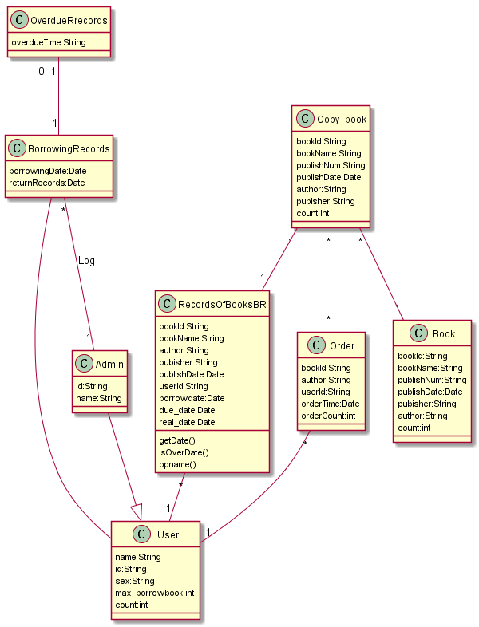

# 实验3：图书管理系统领域对象建模（老师示范）
|学号|班级|姓名|照片|
|:-------:|:-------------: | :----------:|:---:|
|201710414217|软件(本)17-2|17.唐宇杭||

## 1. 图书管理系统的类图

### 1.1 类图PlantUML源码如下：

``` @startuml
阅读者信息<|--读者
阅读者信息 :  name:String
阅读者信息 :  id:String
阅读者信息 :  sex:String
阅读者信息 :  max_borrowbook:int
阅读者信息 :  count:int
读者 : id:String
借书记录--读者
借书记录 : 借书日期:Date
借书记录 : 归还日期:Date
逾期记录"0..1"--"1"借书记录
逾期记录 : 逾期天数:String
罚款细则"0..1"--"*"逾期记录 : "使用"
借书记录"*"--"1"管理员 : "登记"
管理员--|>阅读者信息
管理员 : id:String
管理员 : name:String
借还书记录"*"--"1"阅读者信息
借还书记录 : 书号:String
借还书记录 : 书名:String
借还书记录 : 作者:String
借还书记录 : 出版社名:String
借还书记录 : 出版日期:Date
借还书记录 : 读者姓名:String
借还书记录 : borrowdate:Date
借还书记录 : due_date:Date
借还书记录 : real_date:Date
借还书记录 : getDate()
借还书记录 : isOverDate()
借还书记录 : opname()
预约"*"--"1"阅读者信息
预约 : 书名:String
预约 : 作者:String
预约 : 读者id:String
预约 : 预约时间:Date
预约 : 预约数量:int
Copy_book"*"--"*"预约
Copy_book : 书号:String
Copy_book : 书名:String
Copy_book : 出版号:String
Copy_book : 出版日期:Date
Copy_book : 作者:String
Copy_book : 出版社名:String
Copy_book : count:int
Copy_book"1"--"1"借还书记录
Copy_book"*"--"1"book
book : 书号:String
book : 书名:String
book : 出版号:String
book : 出版日期:Date
book : 出版社名:String
book : 作者:String
book : 数量:int
@enduml
```

### 1.2. 类图如下：



### 1.3. 类图说明：
主要的人员有用户和管理员，关系有借还书，预约等。
管理员主要负责登记用户的各种信息。
用户可以在系统上进行预约和借书等操作。
## 2. 图书管理系统的对象图
### 2.1 类user的对象图
#### 源码如下：
``` class
@startuml
object user {
name = "Dummy"
id = 123
sex = '男'
max_borrowbook=12
count=3
}
@enduml
``` 
#### 对象图如下：

