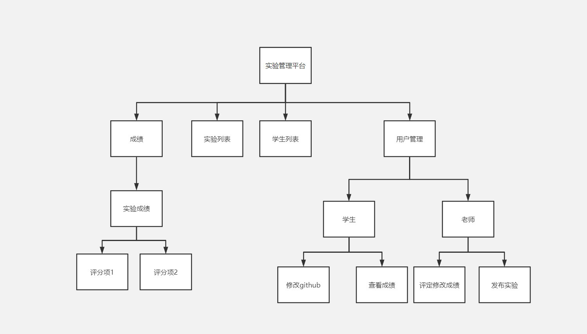
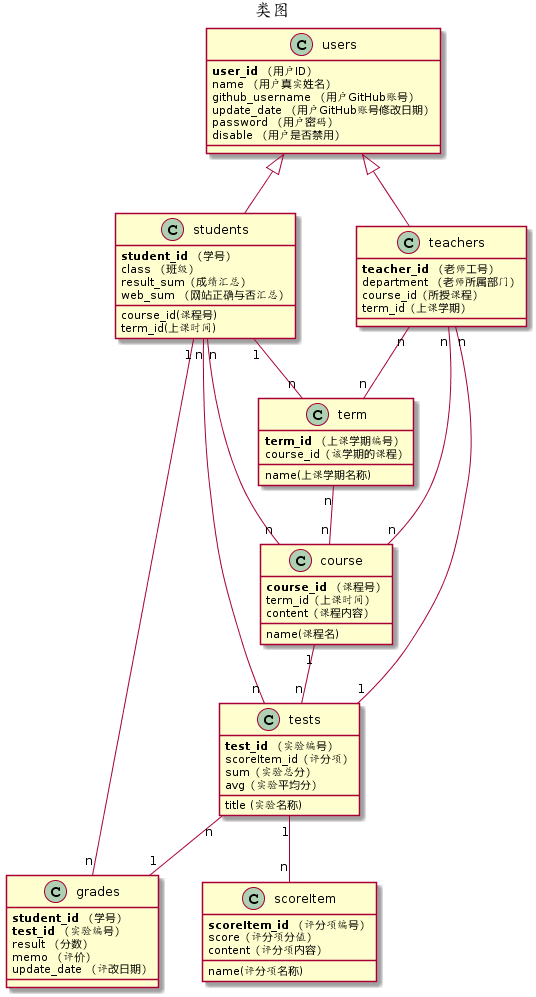

<!-- markdownlint-disable MD033-->
<!-- 禁止MD033类型的警告 https://www.npmjs.com/package/markdownlint -->

# 基于GitHub的实验管理平台的分析与设计

### 成都大学信息科学与工程学院

|学号|班级|姓名|照片|
|:-------:|:-------------: | :----------:|:---:|
|201710414217|软件(本)17-2|17.唐宇杭||

## 1. 概述
- 基于GitHub的实验管理平台的作用是在线管理实验成绩的Web应用系统。学生和老师的实验内容均存放在GitHUB
页面上。
- 学生的功能主要有：一是设置自己的GitHub用户名，二是查询自己的实验成绩。学生的GitHub用户名是公开的，但成绩不公开。
- 老师的功能主要有：一是批改每个学生的成绩，二是查看每个学生的成绩。
- 老师和学生都能通过本系统的链接方便地跳转到学生的每个GitHUB实验目录，以便批改实验或者查看实验情况。
- 实验成绩按数字分数计算，每项实验的满分为100分，最低为0分。
- 系统自动计算每个学生的所有实验的平均分。
    
## 2. 系统总体结构

## 3. 用例图设计 [源码](src/UseCase.puml)

## 4. 类图设计 [源码](src/class.puml)

## 5. 数据库设计
- ### [参见数据库设计](./数据库设计.md)

## 6.用例、界面及API综合设计
---

- [学生列表用例](用例/students.md)

- [设置github地址用例](用例/setGithub.md)

- [选择课程和所上学期用例](用例/setCourse.md)

- [查看实验用例](用例/searchTest.md)

- [查看成绩用例](用例/searchGrades.md)

- [查看课程成绩用例](用例/searchCourseGrades.md)

- [修改密码用例](用例/rePwd.md)

- [发布实验用例](用例/publishTest.md)

- [修改实验用例](用例/publishTest.md)

- [登出系统用例](用例/loginOut.md)

- [登录系统用例](用例/login.md)

- [获取用户信息用例](用例/getUserInfo.md)

- [评定成绩用例](用例/enterGrades.md)
